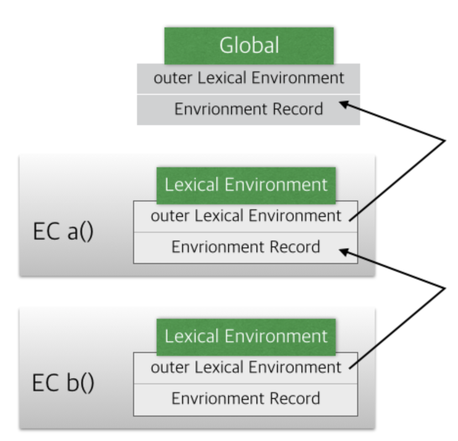

# scopeCHain

    function a(){
    var a = 1;               (A)
    function b(){
    console.log(a);  (B)
    }
    b();
    }
    a();

결과는 1.

a()에 변수 a값을 출력한다.

함수 b()에 선언도 안되어있는 외부에 있는 변수 a값을 어떻게 출력할 수 있었을까?

**scopechain**

`scope` 범위
`chain` 사슬

범위 사슬, 범위 연쇄 등으로 직역할 수 있다. 이 번역을 유추해보면 **어떤 범위 안에 범위에 연쇄적으로 사슬처럼 올라간다** 라고 유추할 수 있다.

다시 코드를 보며 순서대로 해석해보자.

1. a()와 b()가 실행되면서 b()함수 내 변수 a를 탐색하기 시작한다.

2. 그러나 함수 b()에 변수 a가 없다.

3. 그렇다면 함쑤 b()를 감싸고 있는 외부함수인 a()를 탐색한다.

4. 이 때 변수 a가 존재하네? 그럼 그 a를 참조하게 된다.

5. 만약 없다면 계속해서 상위 함수를 탐색한다.

이것이 **스코프체인!**

결국 찾지 못하고 Global Object EC까지 오게 되고 없으면 a가 없다고 `VM500:1 Uncaught ReferenceError: a is not defined` 에러를 보여준다.

# 결론

한마디로 **스코프체인**은 **식별자**를 찾는 **과정**이다.

## 내부 작동방식

함수 a()가 실행이 되면 EC가 생성되고 Lexical Environment가 함수 a()의 정보를 담기며 생성된다.
EC b(), EC a(), Global이 생성되고, outer Lexical Environmnet에 의해서 **연결**이 된다.

#### 약자 뜻

`EC` - Execution Context(**실행컨텍스트**)

`LE` - Lexical Environment(**어휘 환경**)

`outerLE` - outer Lexical Environment(**외부 어휘 환경**)

## 최종 정리

1. 함수 생성
2. EC 생성
3. LE가 outerLE가 상위 ER와 연결되면서 내부 함수 정보를 탐색할 수 있게 됨.

그렇기 때문에 b()함수 내 변수 a가 함수 a()내 변수 a를 참조하여 에러 없이 결과출력이 가능하다.